# 🛍️ E-Commerce Platform

이벤트 기반 아키텍처를 적용한 확장 가능한 이커머스 플랫폼입니다.


## 📌 프로젝트 개요

Spring Boot 3 기반의 **프로덕션 레벨 이커머스 API 플랫폼**으로, MSA(Microservices Architecture) 전환을 위한 이벤트 기반 설계를 적용했습니다.

### 핵심 특징

- ✅ **헥사고날 아키텍처** - Ports & Adapters 패턴으로 도메인과 인프라 계층 분리
- ✅ **이벤트 기반 설계** - Kafka를 활용한 비동기 메시징 및 이벤트 스트리밍
- ✅ **분산 시스템 패턴** - Outbox 패턴, Saga 패턴, 멱등성 보장
- ✅ **동시성 제어** - Redis 분산 락, 낙관적/비관적 락
- ✅ **다층 캐싱** - Redis 캐시를 활용한 성능 최적화
- ✅ **확장 가능한 설계** - 커서 기반 페이징, Kafka 파티셔닝

---

## 🏗️ 시스템 아키텍처

### 전체 구성도

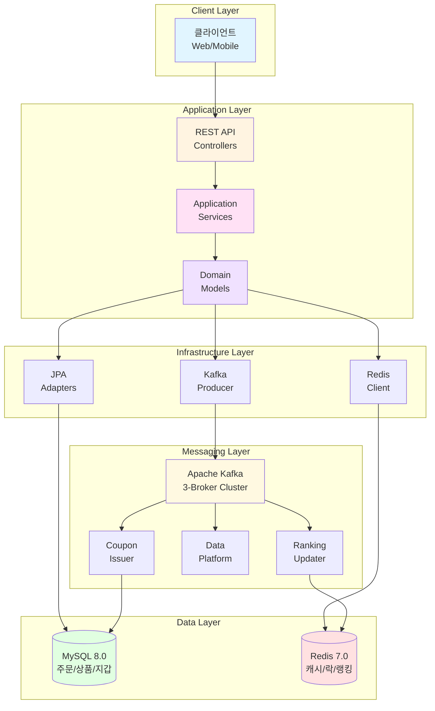

### 헥사고날 아키텍처 구조

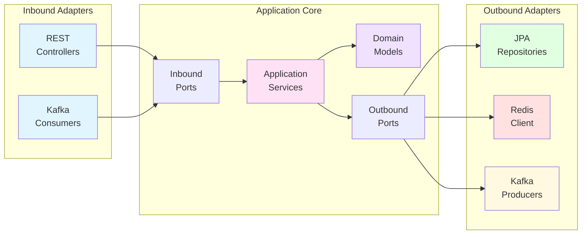

---

## 📡 주요 API 엔드포인트

| 메서드 | 엔드포인트 | 설명 | 주요 기능 |
|--------|-----------|------|----------|
| GET | `/api/v1/products` | 상품 목록 조회 | 커서 기반 페이징, 검색, Redis 캐싱 (3분) |
| GET | `/api/v1/products/{id}` | 상품 상세 조회 | Redis 캐싱 (10분) |
| POST | `/api/v1/wallets/{userId}/topups` | 지갑 충전 | 멱등성 보장, 비관적 락 |
| POST | `/api/v1/orders` | 주문 생성 | 재고 검증, 쿠폰 적용, 분산 락 |
| PATCH | `/api/v1/orders/{orderId}/complete` | 주문 완료 | 이벤트 발행 (Kafka) |
| POST | `/coupons/{id}/issue` | 쿠폰 발급 (동기) | 분산 락, Redis 원자적 카운터 |
| POST | `/coupons/{id}/issue-async` | 쿠폰 발급 (비동기) | Kafka 기반, Lua 스크립트 |
| GET | `/api/v1/rankings/products` | 상품 랭킹 조회 | Redis Sorted Set, 실시간/일별/주간 |

---

## 🔄 API 시퀀스 다이어그램

각 API의 상세한 처리 흐름을 확인하려면 아래 항목을 클릭하세요.

<details>
<summary><b>📦 상품 목록 조회 API</b> - GET /api/v1/products</summary>

### 상품 목록 조회 플로우
- Redis 캐시 우선 조회 (3분 TTL)
- 캐시 미스 시 DB 조회 후 캐싱
- 커서 기반 페이징으로 대용량 데이터 처리

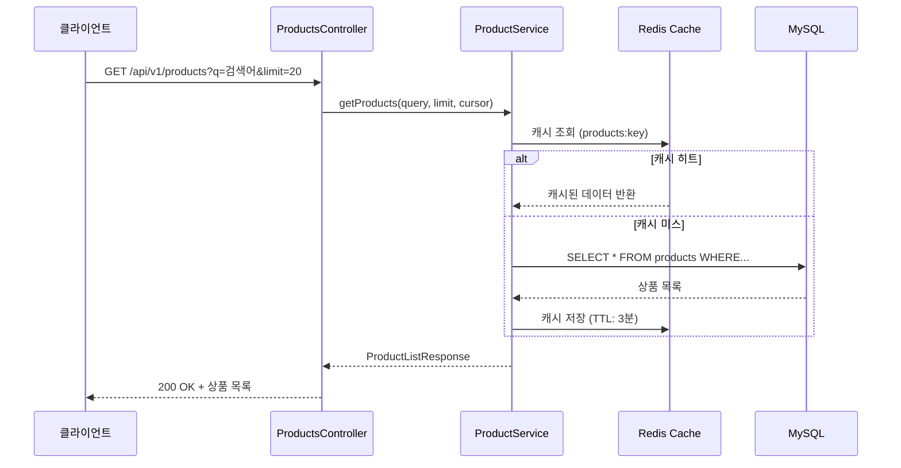

</details>

<details>
<summary><b>📦 상품 상세 조회 API</b> - GET /api/v1/products/{id}</summary>

### 상품 상세 조회 플로우
- Redis 캐시 우선 조회 (10분 TTL)
- 상품 정보 + 가격 정보 포함

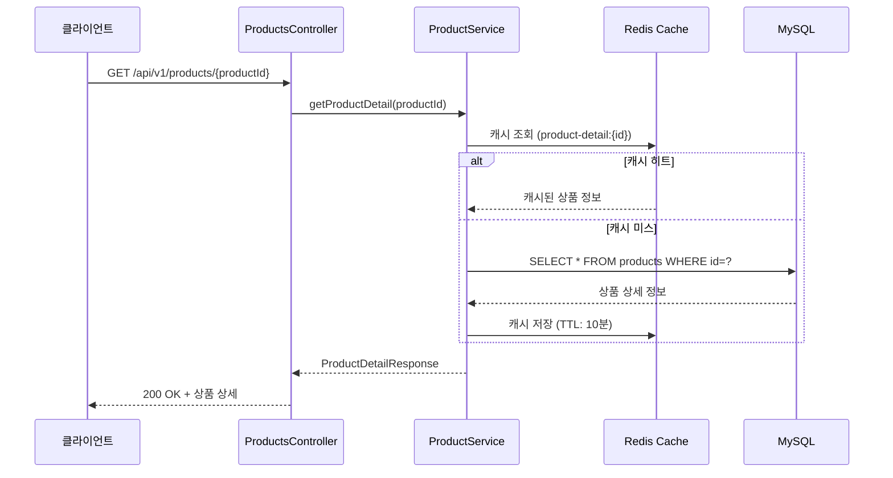

</details>

<details>
<summary><b>💰 지갑 충전 API</b> - POST /api/v1/wallets/{userId}/topups</summary>

### 지갑 충전 플로우
- 멱등성 보장 (Idempotency-Key 헤더)
- 비관적 락(SELECT FOR UPDATE)을 통한 동시성 제어
- 거래 내역 추적 및 잔액 오버플로우 방지

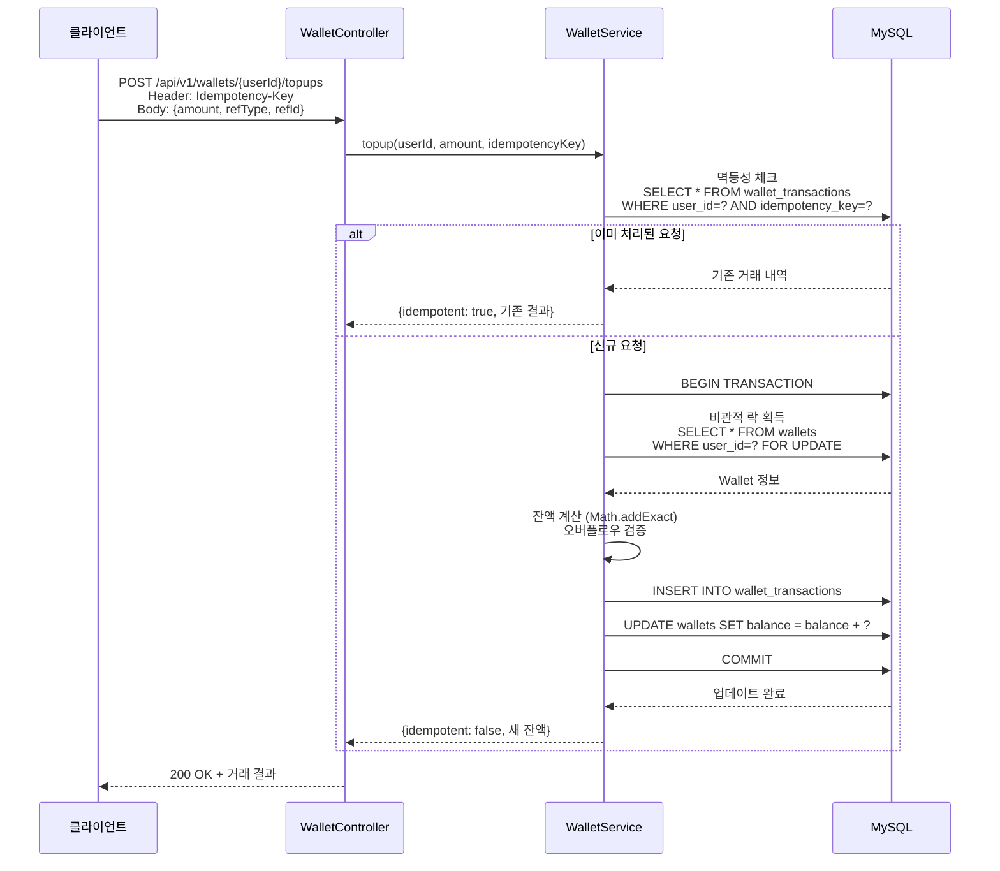

</details>

<details>
<summary><b>🛒 주문 생성 API</b> - POST /api/v1/orders</summary>

### 주문 생성 플로우
- 병렬 검증: 재고, 쿠폰, 지갑 잔액
- Redis 분산 락 기반 재고 예약
- 실패 시 보상 트랜잭션 실행 (재고 복원, 쿠폰 해제, 지갑 환불)

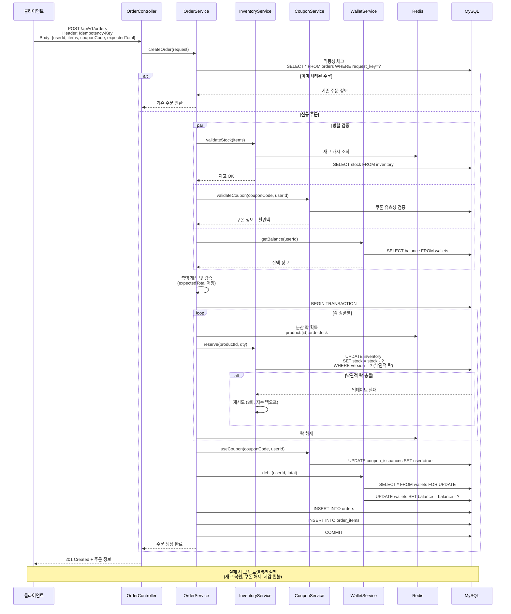

</details>

<details>
<summary><b>✅ 주문 완료 API</b> - PATCH /api/v1/orders/{orderId}/complete</summary>

### 주문 완료 및 이벤트 발행 플로우
- Spring Application Event로 즉시 발행
- Outbox 패턴으로 이벤트 영속성 보장
- Kafka로 다중 컨슈머에게 전달 (랭킹 업데이트, 데이터 플랫폼)

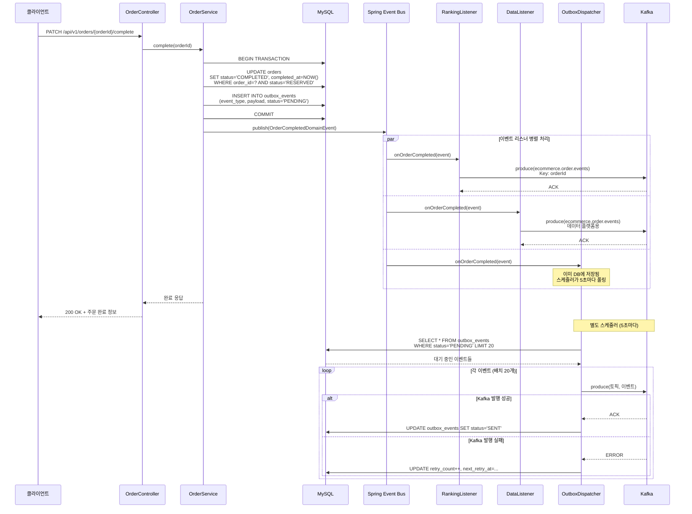

</details>

<details>
<summary><b>🎟️ 쿠폰 발급 API (동기)</b> - POST /coupons/{id}/issue</summary>

### 동기 쿠폰 발급 플로우
- Redis 분산 락으로 동시 요청 제어
- Redis INCR로 원자적 카운터 증가
- 선착순 제한 검증 및 DB 저장

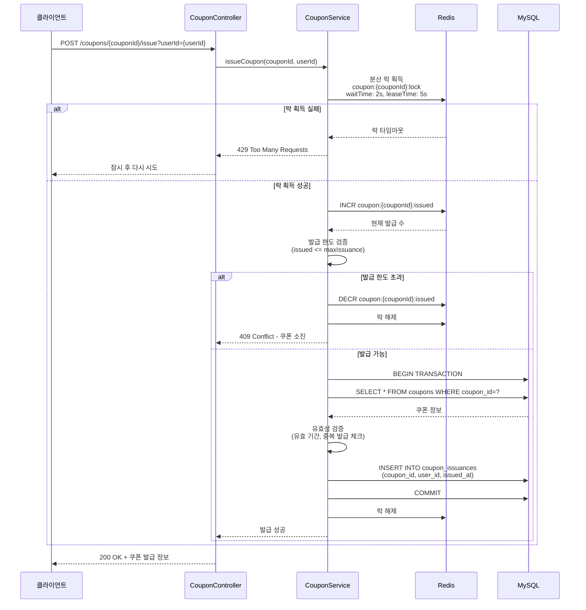

</details>

<details>
<summary><b>🎟️ 쿠폰 발급 API (비동기)</b> - POST /coupons/{id}/issue-async</summary>

### 비동기 쿠폰 발급 플로우 (Kafka)
- Kafka Producer로 즉시 응답 (202 Accepted)
- Kafka Consumer가 비동기로 처리
- Redis Lua Script로 원자적 검증 및 증가
- 결과는 별도 토픽으로 전송

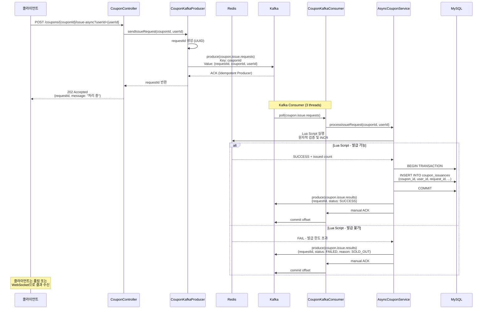

</details>

<details>
<summary><b>🏆 상품 랭킹 조회 API</b> - GET /api/v1/rankings/products</summary>

### 상품 랭킹 조회 플로우
- Redis Sorted Set 조회 (O(log n) 성능)
- 실시간/일별/주간 랭킹 지원
- Graceful degradation (Redis 장애 시 빈 결과)

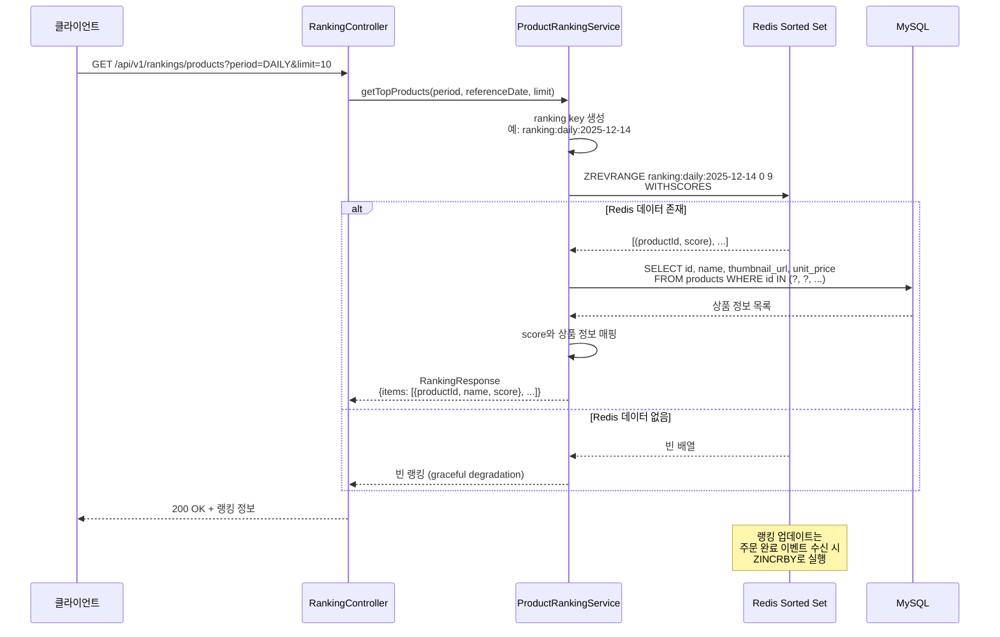

</details>

---

## 💾 데이터베이스 설계

<details>
<summary><b>📊 ERD (Entity Relationship Diagram)</b></summary>

### 데이터베이스 ERD

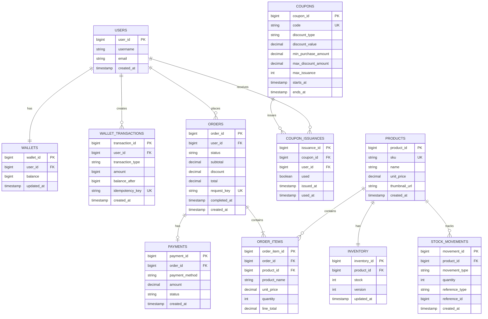

### 주요 테이블 설명

- **USERS**: 사용자 계정 정보
- **WALLETS**: 사용자별 지갑 잔액 (1:1)
- **WALLET_TRANSACTIONS**: 지갑 거래 내역 (충전/차감), 멱등성 키 포함
- **PRODUCTS**: 상품 카탈로그
- **INVENTORY**: 재고 관리 (낙관적 락 version 필드)
- **STOCK_MOVEMENTS**: 재고 변동 이력 (감사 추적)
- **ORDERS**: 주문 정보 (request_key로 멱등성 보장)
- **ORDER_ITEMS**: 주문 상품 목록
- **COUPONS**: 쿠폰 정의 (할인율, 한도, 유효기간)
- **COUPON_ISSUANCES**: 사용자별 쿠폰 발급 내역

</details>

---

## 📨 Kafka 이벤트 아키텍처

<details>
<summary><b>🔄 Kafka 토픽 및 컨슈머 구조</b></summary>

### Kafka 토픽 및 컨슈머 그룹

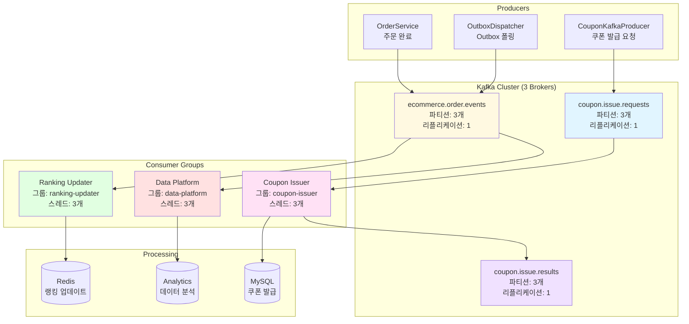

### Kafka 설정 요약

**Producer 설정:**
- Acks: `all` (모든 복제본 확인)
- Idempotence: `enabled` (중복 방지)
- Compression: `snappy` (압축)
- Retries: `3`

**Consumer 설정:**
- Auto Offset Reset: `earliest`
- Enable Auto Commit: `false` (수동 ACK)
- Max Poll Records: `500`
- Concurrency: `3` (각 컨슈머 그룹당)

</details>

---

## 🚀 캐싱 전략

<details>
<summary><b>⚡ Redis 캐싱 전략 (Cache-Aside Pattern)</b></summary>

### 캐시 읽기 플로우

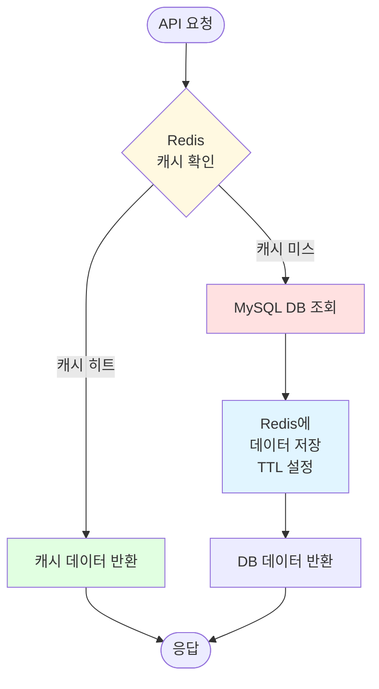

### 캐시 영역 및 TTL

| 캐시 영역 | 키 패턴 | TTL | 용도 |
|----------|---------|-----|------|
| `products` | `products:*` | 3분 | 상품 목록 |
| `product-detail` | `product-detail:{id}` | 10분 | 상품 상세 |
| `coupon-info` | `coupon-info:{id}` | 5분 | 쿠폰 정보 |
| `user-orders` | `user-orders:{userId}` | 10분 | 사용자 주문 목록 |
| `product:{id}:stock` | - | 30초 | 실시간 재고 |
| `ranking:*` | `ranking:{period}:{date}` | 1시간 | 상품 랭킹 (Sorted Set) |

### 분산 락 키

| 락 타입 | 키 패턴 | Wait Time | Lease Time |
|--------|---------|-----------|------------|
| 쿠폰 발급 | `coupon:{id}:lock` | 2초 | 5초 |
| 재고 예약 | `product:{id}:order:lock` | 2초 | 10초 |

</details>

---

## 🛠️ 기술 스택

### 백엔드 프레임워크
- **Spring Boot** 3.4.1
- **Spring Cloud** 2024.0.0
- **Java** 17

### 데이터 저장소
- **MySQL** 8.0 - 주문, 상품, 사용자 데이터
- **Redis** 7.0 - 캐싱, 분산 락, 랭킹

### 메시징
- **Apache Kafka** 7.6.0 - 이벤트 스트리밍
- 3-broker 클러스터
- 4개 토픽 (주문 이벤트, 쿠폰 발급 요청/결과)

### 주요 라이브러리
- **Spring Data JPA** - ORM
- **Redisson** - 분산 락
- **Lettuce** - Redis 클라이언트
- **Spring Kafka** - Kafka 통합
- **SpringDoc OpenAPI** - API 문서 (Swagger UI)
- **Testcontainers** - 통합 테스트
- **Lombok** - 보일러플레이트 코드 제거

---

## ✨ 주요 기능

### 1. 상품 카탈로그
- ✅ 커서 기반 페이징 (대용량 데이터 최적화)
- ✅ Redis 캐싱 (3분 TTL)
- ✅ 전체 텍스트 검색 및 카테고리 필터링
- ✅ 정렬 옵션 (ID, 이름, 가격 등)

### 2. 지갑 관리
- ✅ 멱등성 보장 (Idempotency-Key 헤더)
- ✅ 비관적 락(SELECT FOR UPDATE)을 통한 동시성 제어
- ✅ 거래 내역 추적
- ✅ 오버플로우 방지 (Math.addExact)
- ✅ 환불 메커니즘 (보상 트랜잭션)

### 3. 주문 처리
- ✅ 포괄적인 검증:
  - 재고 가용성 체크 (낙관적 락)
  - 쿠폰 적용 가능 여부 검증
  - 지갑 잔액 확인
  - 총액 매칭 (충돌 감지)
- ✅ 주문 완료 시 이벤트 발행
- ✅ 멱등성 보장 (request_key)
- ✅ 다중 상품 주문 지원
- ✅ 할인 계산 (비율/고정 금액)
- ✅ 쿠폰 사용 추적

### 4. 쿠폰 시스템
- ✅ 두 가지 발급 방식:
  - **동기**: 즉시 발급 (분산 락 사용)
  - **비동기**: Kafka 기반 (Lua 스크립트 검증)
- ✅ 기능:
  - 비율 할인 및 고정 금액 할인
  - 최소 구매 금액 조건
  - 최대 할인 금액 제한
  - 유효 기간 (시작일/종료일)
  - 발급 한도 (선착순)
  - Redis 원자적 카운터로 동시성 제어
  - 쿠폰 해제 (보상 처리)

### 5. 재고 관리
- ✅ 이중 저장소:
  - MySQL (영구 저장)
  - Redis (빠른 조회)
- ✅ 낙관적 락 (version 필드)으로 DB 충돌 방지
- ✅ 재시도 메커니즘 (3회, 지수 백오프)
- ✅ 재고 변동 감사 추적
- ✅ 상품별 분산 락으로 안전한 예약
- ✅ Cache-Aside 패턴으로 빠른 읽기
- ✅ 주문 취소 시 재고 복원

### 6. 상품 랭킹 시스템
- ✅ 다중 랭킹 기간:
  - **REALTIME** - 주문 완료 시 즉시 업데이트
  - **DAILY** - 일별 집계 랭킹
  - **WEEKLY** - 주간 집계 랭킹
- ✅ Redis Sorted Set으로 O(log n) 성능
- ✅ Spring Application Events + Kafka로 업데이트
- ✅ 점수 기준:
  - 주문 수량
  - 판매 금액
  - 고객 참여 지표
- ✅ 과거 날짜 조회 지원
- ✅ Graceful degradation (Redis 장애 시 빈 결과)

---

## 🔒 동시성 제어 전략

| 기능 | 제어 방식 | 설명 |
|------|----------|------|
| **지갑 충전/차감** | 비관적 락 | `SELECT ... FOR UPDATE`로 트랜잭션 격리 |
| **재고 예약** | 분산 락 (Redisson) | `product:{id}:order:lock`으로 상품별 직렬화 |
| **쿠폰 발급** | 분산 락 + Redis INCR | `coupon:{id}:lock` + 원자적 카운터 |
| **재고 업데이트** | 낙관적 락 | `version` 필드로 충돌 감지 및 재시도 |
| **멱등성 보장** | DB Unique 제약 | `(user_id, idempotency_key)` 복합 유니크 키 |

### Deadlock 방지
- 정렬된 순서로 락 획득 (product_id 오름차순)
- Timeout 설정 (2초 wait, 5-10초 lease)
- 실패 시 빠른 실패 전략 (Fail-Fast)

---

## 🏛️ 아키텍처 패턴

### 1. 헥사고날 아키텍처 (Ports & Adapters)
- **Inbound Ports**: 유즈케이스 인터페이스 (`application.port.in`)
- **Outbound Ports**: 도메인 포트 인터페이스 (`domain.port.out`)
- **Adapters**: JPA 리포지토리가 Outbound Ports 구현

### 2. CQRS (Command Query Responsibility Segregation)
- 읽기 작업 분리 (ProductReadPort, ProductDetailReadPort)
- 쓰기 작업 분리 (OrderWritePort, WalletReadWritePort)

### 3. 이벤트 기반 아키텍처
- 도메인 이벤트를 서비스에서 발행
- 다중 이벤트 리스너가 독립적으로 처리
- Outbox 패턴으로 보장된 전달
- Kafka로 분산 이벤트 스트리밍

### 4. Saga 패턴 (보상 트랜잭션)
- 주문 생성 실패 → 지갑 환불
- 쿠폰 발급 실패 → 발급 내역 해제
- 재고 예약 실패 → 재고 복원

### 5. 멱등성 패턴
- `Idempotency-Key` 헤더로 API 요청 식별
- DB Unique 제약 `(user_id, idempotency_key)`
- 재시도 시 기존 결과 반환

### 6. Cache-Aside 패턴
- Redis 캐시 먼저 확인
- 미스 시 DB 조회
- TTL 기반 캐시 만료
- 상품, 쿠폰, 재고에 적용

### 7. Outbox Event Dispatcher 패턴
- 이벤트를 DB에 트랜잭션 내 저장
- 스케줄러가 5초마다 폴링
- 배치 처리 (20개씩)
- 지수 백오프 재시도 (30초 * retry_count)
- 최종 상태: PENDING, SENT, FAILED

---

## 💻 로컬 개발 환경 설정

### 1. 인프라 실행

Docker Compose로 MySQL, Redis, Kafka를 실행합니다.

```bash
docker-compose up -d
```

**실행되는 서비스:**
- MySQL 8.0 (포트: 3306)
- Redis 7.0 (포트: 6379)
- Apache Kafka 3-broker 클러스터 (포트: 9092, 9093, 9094)
- Zookeeper (포트: 2181)

### 2. 애플리케이션 실행

```bash
./gradlew bootRun
```

- `local` 프로필로 실행 (기본값)
- 자동 스키마 생성 및 데이터 시드 (`schema.sql`, `data.sql`)
- 애플리케이션 포트: `8080`

### 3. Swagger UI 접속

```
http://localhost:8080/swagger-ui.html
```

- `local` 프로필에서만 활성화
- 모든 API 엔드포인트 테스트 가능

### 4. 테스트 실행

```bash
./gradlew test
```

- Testcontainers로 격리된 MySQL 컨테이너 실행
- 통합 테스트 자동 실행
- `UserFlowIntegrationTest`로 전체 사용자 플로우 검증

---

## 📂 프로젝트 구조

```
src/
├── main
│   ├── java/kr/hhplus/be/server
│   │   ├── interfaces/web           # REST Controllers
│   │   ├── application/service      # Application Services (유즈케이스)
│   │   ├── domain/model             # Domain Models (불변 Records)
│   │   └── infrastructure           # Persistence, Cache, Kafka Adapters
│   │       ├── persistence/adapter  # JPA Adapters
│   │       ├── kafka/               # Kafka Producers/Consumers
│   │       ├── lock/                # Distributed Lock
│   │       ├── outbox/              # Outbox Event Dispatcher
│   │       └── config/              # Configuration Classes
│   └── resources
│       ├── application.yml          # Spring 설정
│       ├── schema.sql               # DDL (테이블 생성)
│       └── data.sql                 # 시드 데이터
└── test
    └── java/kr/hhplus/be/server
        └── interfaces/web           # 통합 테스트 (Testcontainers)
```

---

## 📚 추가 문서

- [API 명세서](./docs) - 상세 API 계약서
- [ERD](./docs/ERD.md) - 엔티티 관계 다이어그램
- [인프라 구성도](./docs/인프라_구성도.md) - 인프라 토폴로지 및 컴포넌트 책임
- [동시성 제어 설계](./docs/claude-code/concurrency-control-design.md) - 락 전략, Redis 사용법, 테스트 계획

---

## 🚀 빠른 시작

```bash
# 1. 리포지토리 클론 및 Java 17 설치
git clone <repository-url>
cd ecommerce-platform

# 2. 인프라 실행 (MySQL, Redis, Kafka)
docker-compose up -d

# 3. 애플리케이션 실행
./gradlew bootRun

# 4. Swagger UI에서 API 테스트
open http://localhost:8080/swagger-ui.html

# 5. 테스트 실행
./gradlew test
```

---

## 📞 문의 및 기여

이슈나 개선 제안은 GitHub Issues를 통해 등록해주세요.

---

**Built with ❤️ using Spring Boot 3, Kafka, Redis, and MySQL**
