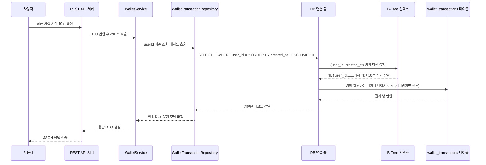

# 데이터베이스 인덱스 설계 개요

이 문서는 전자상거래 플랫폼에서 **지갑 거래**, **주문 멱등성**, **아웃박스 이벤트 재시도**를 빠르게 처리하기 위해 설계한 인덱스를 정리합니다. 인덱스가 처음인 분도 이해할 수 있도록 용어부터 구현 위치까지 단계별로 설명합니다.

## 1. 인덱스 기본 용어

| 용어 | 설명 |
| --- | --- |
| 인덱스(Index) | 책의 목차처럼 특정 컬럼 값을 정렬해 둔 보조 자료구조입니다. 원하는 행을 테이블 전체를 스캔하지 않고 빠르게 찾을 수 있게 해줍니다. 대부분의 RDBMS에서는 **B-Tree** 구조를 사용합니다. |
| 유니크 인덱스(Unique Index) | 인덱스가 가리키는 컬럼 조합에 동일한 값이 두 번 이상 저장되지 않도록 강제합니다. 비즈니스에서 "중복 방지" 규칙을 데이터베이스 수준에서 보장하고 싶을 때 사용합니다. |
| 복합 인덱스(Composite Index) | 두 개 이상의 컬럼을 순서대로 묶어 만든 인덱스입니다. 첫 번째 컬럼부터 차례대로 조건을 걸 때 성능이 좋습니다. |
| 커버링 인덱스(Covering Index) | 실행 계획에서 필요한 값이 인덱스만으로 충족돼 테이블 데이터 페이지를 추가로 읽을 필요가 없는 경우를 말합니다. 예: `user_id`, `created_at`만 조회하면 되는 쿼리에서 동일 컬럼으로 구성된 인덱스를 쓰면 커버링이 됩니다. |
| 카디널리티(Cardinality) | 인덱스 컬럼이 얼마나 다양한 값을 가지는지 나타내는 지표입니다. 값이 다양할수록(=카디널리티가 높을수록) 인덱스 성능이 좋아집니다. |

## 2. 설계 목표 정리

인덱스를 추가하기 전에, 실제 서비스에서 잦은 작업과 병목 지점을 파악했습니다.

1. **지갑 거래 내역**은 "특정 사용자의 최근 거래 10건"과 같이 시간순 조회가 잦습니다. 또한 외부 결제와 연동된 멱등키로 중복 삽입을 막아야 합니다.
2. **주문 API**는 클라이언트가 `request_key`로 같은 주문을 재시도할 수 있으므로, 사용자 단위로 중복을 차단해야 합니다.
3. **이벤트 아웃박스**는 워커가 `status`와 `next_retry_at`을 기준으로 재시도 대상을 찾고, 모니터링 화면에서는 생성 시간순 정렬을 자주 사용합니다.

이 목표를 토대로 어떤 컬럼 조합이 자주 조건/정렬에 쓰이는지 목록화하고, 인덱스 방향을 정했습니다.

## 3. 인덱스별 상세 설계와 사용 시나리오

### 3.1 지갑 거래(`wallet_transactions`)

| 인덱스 이름 | 컬럼 조합 | 목적 |
| --- | --- | --- |
| `idx_wt_user_created` | `(user_id, created_at)` | 사용자별 거래 히스토리를 최신순으로 빠르게 읽기 위한 일반 인덱스입니다. 정렬까지 커버하므로 `ORDER BY created_at DESC LIMIT 10` 같은 쿼리가 테이블 풀 스캔 없이 처리됩니다. |
| `idx_wt_idem` | `(user_id, idempotency_key)` **유니크** | 외부 결제 멱등키로 같은 요청이 두 번 들어왔을 때 두 번째 저장을 차단합니다. 유니크 제약이 있으므로 애플리케이션에서 중복 검사를 별도로 하지 않아도 DB가 오류를 발생시켜줍니다. |

**왜 이런 순서인가요?**
- 사용자별로 조회하기 때문에 첫 컬럼을 `user_id`로 잡았습니다.
- `created_at`은 범위 조건이나 정렬에 사용되므로 두 번째 컬럼으로 두어 복합 인덱스 효과를 살립니다.
- 멱등키는 사용자에 종속된 값이라 `(idempotency_key, user_id)` 순서보다는 `(user_id, idempotency_key)`가 카디널리티가 높습니다.

**관련 소스**
- JPA 엔티티: `WalletTransactionEntity`에서 `@Index` 선언으로 의도를 명시합니다.【F:src/main/java/kr/hhplus/be/server/infrastructure/persistence/entity/WalletTransactionEntity.java†L10-L38】
- 초기 스키마: `schema.sql`에서 동일한 인덱스를 정의해 수동 배포 환경에서도 일관성을 유지합니다.【F:src/main/resources/schema.sql†L29-L51】

### 3.2 주문(`orders`)

| 인덱스 이름 | 컬럼 조합 | 목적 |
| --- | --- | --- |
| `idx_orders_request_key` (엔티티) / `uq_orders_user_request` (DDL) | `(user_id, request_key)` **유니크** | 같은 사용자가 같은 `request_key`로 주문을 중복 생성하는 것을 방지합니다. REST API 클라이언트가 네트워크 오류 후 재시도하더라도 한 번만 주문이 생깁니다. |

**설계 배경**
- `request_key`는 클라이언트가 발급하는 멱등 토큰입니다.
- 사용자마다 토큰 중복 가능성이 있으므로 `user_id`와 묶어 유니크 제약을 줍니다.

**관련 소스**
- 엔티티: `OrderEntity`의 `@Table(indexes = …)` 선언.【F:src/main/java/kr/hhplus/be/server/infrastructure/persistence/entity/OrderEntity.java†L10-L23】
- 초기 스키마: `schema.sql`의 `orders` 테이블 DDL에서 유니크 키 정의.【F:src/main/resources/schema.sql†L93-L114】
- 운영 보강: `data.sql`이 인덱스 존재 여부를 확인한 뒤 없으면 `ALTER TABLE`로 추가합니다. 기존 데이터의 `request_key`를 먼저 채운 뒤 제약을 걸어 오류를 예방합니다.【F:src/main/resources/data.sql†L94-L166】

### 3.3 아웃박스 이벤트(`outbox_events`)

| 인덱스 이름 | 컬럼 조합 | 목적 |
| --- | --- | --- |
| `idx_outbox_status_next` | `(status, next_retry_at)` | 재시도 워커가 "처리 대기 상태이면서 재시도 시간이 지난" 레코드를 빠르게 찾도록 도와줍니다. 조건은 `WHERE status='PENDING' AND next_retry_at <= NOW()` 형태입니다. |
| `idx_outbox_created` | `(created_at)` | 운영자가 모니터링할 때 생성 순으로 페이지네이션 하기 위한 인덱스입니다. |

**관련 소스**
- 엔티티: `OutboxEventEntity`에 인덱스 메타데이터를 선언합니다.【F:src/main/java/kr/hhplus/be/server/infrastructure/persistence/entity/OutboxEventEntity.java†L10-L46】
- 초기 스키마: `schema.sql`에서 동일 인덱스를 생성합니다.【F:src/main/resources/schema.sql†L130-L151】
- 마이그레이션: `data.sql`은 컬럼 유무를 확인하고 필요한 컬럼을 추가하지만, 인덱스는 스키마 파일에서 관리하므로 중복 실행 위험이 없습니다.【F:src/main/resources/data.sql†L167-L238】

## 4. 인덱스 유무에 따른 차이

### 4.1 응답 시간과 자원 사용 비교

| 구분 | 인덱스 없음 (Full Table Scan) | 인덱스 있음 (Index Range Scan) |
| --- | --- | --- |
| 읽기 경로 | 모든 레코드를 순차적으로 확인해야 하므로 **테이블 전체를 스캔**합니다. | 인덱스가 정렬해 둔 키 범위를 먼저 읽고, 필요한 데이터 페이지만 접근합니다. |
| 예상 비용 | 레코드 수에 비례해 증가합니다. `wallet_transactions`처럼 수십만 건 이상이면 디스크 I/O와 CPU 사용량이 급격히 늘어납니다. | 조건에 맞는 키 범위만 탐색하므로 I/O가 크게 줄어듭니다. 수만 건 중 몇 건만 읽어도 응답 시간이 일정하게 유지됩니다. |
| 동시성 영향 | 느린 쿼리가 락을 오래 잡고 있어 다른 트랜잭션이 대기열에 쌓일 수 있습니다. | 쿼리가 빨리 끝나 대기 시간이 짧고, 동일 테이블에 대한 동시 트래픽을 더 안정적으로 처리합니다. |
| 캐시 효과 | 매번 전체 데이터를 읽어 버퍼 풀(Cache)을 자주 교체하게 됩니다. | 필요한 페이지 위주로 접근하므로 자주 쓰는 페이지가 버퍼 풀에 남아 재사용됩니다. |

> 예시: 특정 사용자의 최근 10건 지갑 거래를 조회할 때 인덱스가 없다면 DB는 모든 사용자의 거래를 읽어 조건을 비교해야 합니다. 인덱스가 있다면 `(user_id, created_at)` 트리에서 해당 사용자의 위치로 바로 이동해 최신 10건만 읽으면 끝납니다.

### 4.2 유저 요청부터 인덱스 탐색까지의 순차 흐름

이 시퀀스에서 핵심은 `DB -> Index` 단계입니다. 인덱스가 없으면 DB는 `Table`을 처음부터 끝까지 스캔해야 하므로, 중간에 `Index` 단계를 거쳐 빠르게 범위를 좁히는 효과가 사라집니다.

## 5. 구현 방법 요약

| 단계 | 설명 |
| --- | --- |
| JPA 엔티티 선언 | 각 엔티티의 `@Table(indexes = …)` 또는 `@Table(uniqueConstraints = …)`를 사용해 ORM이 스키마를 자동 생성할 때 인덱스까지 반영하도록 합니다. 이는 테스트 환경이나 새 데이터베이스 구축 시 누락을 방지합니다. |
| 초기 스키마 DDL (`schema.sql`) | 인프라 팀이 직접 DB를 구축할 수도 있으므로 SQL 스크립트에도 같은 인덱스를 명시했습니다. 애플리케이션이 실행되지 않아도 DB 구조를 재현할 수 있습니다. |
| 마이그레이션 스크립트 (`data.sql`) | 이미 운영 중인 DB에선 인덱스가 빠져 있을 수 있으므로, 정보 스키마를 조회해 존재 여부를 확인한 뒤 없을 때만 `ALTER TABLE`을 실행합니다. 또한 제약을 추가하기 전에 관련 컬럼 데이터가 준비됐는지 확인합니다. |

이렇게 **애플리케이션 코드 → 초기 스키마 → 운영 마이그레이션**이 서로 같은 인덱스 구성을 바라보도록 맞춰, 환경에 따라 일부가 빠지는 상황을 예방했습니다.

## 6. 운영 시 주의사항

1. **쓰기 지연 고려**: 인덱스가 많아질수록 INSERT/UPDATE 비용이 커지므로, 실시간 분석이나 검색용 인덱스를 추가하고 싶다면 트래픽 패턴을 먼저 확인하세요.
2. **쿼리 검증**: 새로운 인덱스를 추가하기 전에는 `EXPLAIN`으로 실제 쿼리가 해당 인덱스를 사용하는지 확인합니다. 컬럼 순서나 조건이 맞지 않으면 인덱스가 무시될 수 있습니다.
3. **배포 순서**: 유니크 인덱스를 추가할 땐 사전에 중복 데이터가 없는지 검사하세요. `data.sql`처럼 잠재적 중복을 먼저 제거하거나 채워 넣은 뒤 제약을 적용하면 안전합니다.

## 7. 참고 링크

- [MySQL 8.0 Reference Manual – B-Tree Index Characteristics](https://dev.mysql.com/doc/refman/8.0/en/index-btree-hash.html)
- [Spring Data JPA – Table Indexes](https://docs.spring.io/spring-data/jpa/docs/current/reference/html/#jpa.entity-persistence.scripting)

---
이 문서가 인덱스 설계를 이해하고 유지보수하는 데 도움이 되길 바랍니다. 추가 질문은 언제든지 환영합니다!
