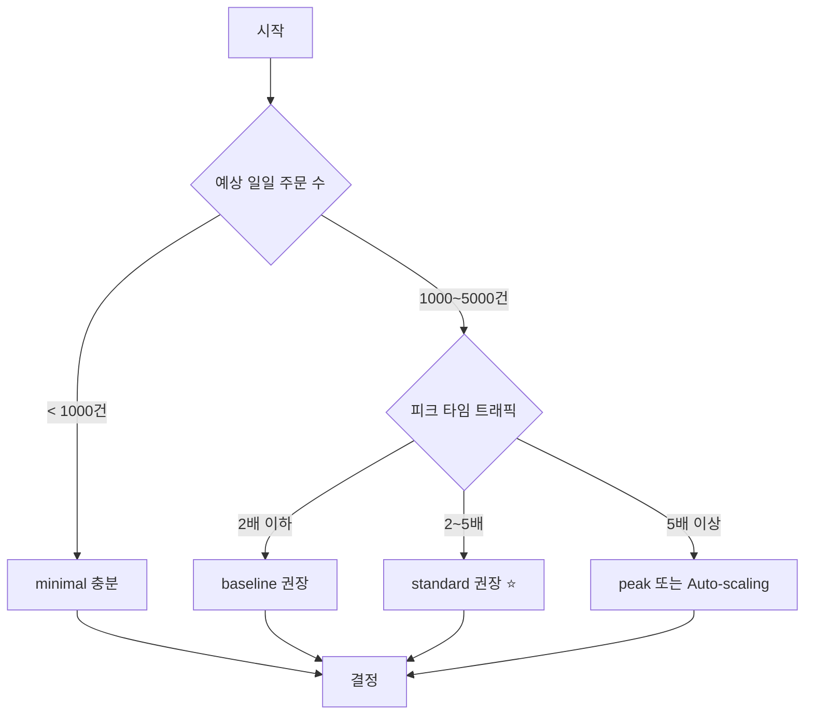

# 리소스 최적화 가이드

## 📊 테스트 매트릭스

이 문서는 다양한 리소스 프로파일에서의 성능을 비교하여 최적 배포 스펙을 결정하기 위한 가이드입니다.

---

## 1. 리소스 프로파일

### 1.1 프로파일 정의

| 프로파일 | CPU | Memory | Heap | Use Case | 예상 비용 |
|---------|-----|--------|------|----------|----------|
| **minimal** | 1 Core | 1GB | 512MB | 개발/테스트 | $10/월 |
| **baseline** | 2 Cores | 2GB | 1GB | 소규모 운영 | $20/월 |
| **standard** | 4 Cores | 4GB | 2GB | 중규모 운영 (권장) | $40/월 |
| **peak** | 8 Cores | 8GB | 4GB | 대규모/피크 대응 | $80/월 |

### 1.2 각 프로파일 실행 방법

```bash
# 1. minimal (최소 스펙)
docker-compose -f docker-compose.loadtest.yml --profile minimal up -d

# 2. baseline (권장 최소)
docker-compose -f docker-compose.loadtest.yml --profile baseline up -d

# 3. standard (권장 스펙)
docker-compose -f docker-compose.loadtest.yml --profile standard up -d

# 4. peak (피크 대응)
docker-compose -f docker-compose.loadtest.yml --profile peak up -d

# 종료
docker-compose -f docker-compose.loadtest.yml down
```

---

## 2. 테스트 절차

### 2.1 각 프로파일별 테스트

**각 프로파일마다 다음 테스트를 수행:**

```bash
# 1. 환경 실행
docker-compose -f docker-compose.loadtest.yml --profile <PROFILE> up -d

# 2. 헬스 체크 대기 (30초)
sleep 30
curl http://localhost:8080/actuator/health

# 3. 테스트 실행
k6 run load-tests/scenarios/01-product-list.js
k6 run load-tests/scenarios/02-product-detail.js
k6 run load-tests/scenarios/03-wallet-topup.js
k6 run load-tests/scenarios/04-order-create.js
k6 run load-tests/scenarios/05-coupon-issue-sync.js
k6 run load-tests/scenarios/06-full-user-journey.js

# 4. 리소스 사용률 측정
docker stats --no-stream ecommerce-app-<PROFILE>

# 5. 환경 종료
docker-compose -f docker-compose.loadtest.yml down
```

### 2.2 측정 항목

각 테스트에서 다음 항목을 기록:

| 항목 | 측정 방법 | 목표 |
|------|----------|------|
| **P95 응답 시간** | k6 `http_req_duration` | < SLA |
| **TPS** | k6 `http_reqs` rate | 최대값 |
| **에러율** | k6 `http_req_failed` | < 1% |
| **CPU 사용률** | `docker stats` CPU % | < 80% |
| **Memory 사용률** | `docker stats` MEM % | < 80% |
| **GC 시간** | JVM metrics | < 1% |

---

## 3. 결과 기록 템플릿

### 3.1 프로파일별 성능 비교표

| 항목 | minimal | baseline | standard | peak |
|------|---------|----------|----------|------|
| **상품 목록 조회** | | | | |
| - P95 Latency (ms) | [ ] | [ ] | [ ] | [ ] |
| - TPS | [ ] | [ ] | [ ] | [ ] |
| - Error Rate (%) | [ ] | [ ] | [ ] | [ ] |
| **주문 생성** | | | | |
| - P95 Latency (ms) | [ ] | [ ] | [ ] | [ ] |
| - TPS | [ ] | [ ] | [ ] | [ ] |
| - Error Rate (%) | [ ] | [ ] | [ ] | [ ] |
| **쿠폰 발급** | | | | |
| - P95 Latency (ms) | [ ] | [ ] | [ ] | [ ] |
| - Success Rate (%) | [ ] | [ ] | [ ] | [ ] |
| **리소스 사용률** | | | | |
| - CPU (%) | [ ] | [ ] | [ ] | [ ] |
| - Memory (%) | [ ] | [ ] | [ ] | [ ] |
| - GC Time (%) | [ ] | [ ] | [ ] | [ ] |

### 3.2 비용 대비 성능 분석

```
성능 향상률 = (standard TPS - baseline TPS) / baseline TPS * 100%
비용 증가율 = (standard 비용 - baseline 비용) / baseline 비용 * 100%
ROI = 성능 향상률 / 비용 증가율
```

**목표:**
- ROI > 1.0 → 비용 대비 성능 우수
- ROI < 1.0 → Over-provisioning 의심

---

## 4. 예상 결과 (가이드라인)

### 4.1 minimal (1 Core, 1GB)

**예상 성능:**
- 상품 조회: 1000 TPS, P95 < 800ms
- 주문 생성: 50 TPS, P95 < 5s
- CPU: 90-100% (포화)
- Memory: 80-90%

**결론:**
- ❌ 프로덕션 부적합
- ✅ 개발/테스트용

### 4.2 baseline (2 Cores, 2GB)

**예상 성능:**
- 상품 조회: 2500 TPS, P95 < 400ms
- 주문 생성: 200 TPS, P95 < 2s
- CPU: 70-80%
- Memory: 60-70%

**결론:**
- ✅ 소규모 운영 가능
- ⚠️  피크 타임 대응 어려움

### 4.3 standard (4 Cores, 4GB) ⭐ **권장**

**예상 성능:**
- 상품 조회: 5000 TPS, P95 < 300ms
- 주문 생성: 500 TPS, P95 < 1.5s
- CPU: 50-60%
- Memory: 50-60%

**결론:**
- ✅ 프로덕션 권장 스펙
- ✅ 피크 타임 대응 가능
- ✅ 여유 리소스로 장애 대응

### 4.4 peak (8 Cores, 8GB)

**예상 성능:**
- 상품 조회: 8000 TPS, P95 < 200ms
- 주문 생성: 800 TPS, P95 < 1s
- CPU: 40-50%
- Memory: 40-50%

**결론:**
- ✅ 대규모 트래픽 대응
- ⚠️  비용 대비 효율 낮음
- 💡 Auto-scaling 고려

---

## 5. 최적 스펙 결정 기준

### 5.1 의사결정 트리



### 5.2 최종 권장사항

**일반적인 케이스:**

| 일일 주문 수 | 동시 접속자 | 권장 스펙 |
|-------------|-----------|----------|
| < 1,000건 | < 100명 | **baseline** (2C/2G) |
| 1,000~10,000건 | 100~500명 | **standard** (4C/4G) ⭐ |
| 10,000~50,000건 | 500~2000명 | **peak** (8C/8G) |
| > 50,000건 | > 2000명 | **Auto-scaling** |

---

## 6. JVM 튜닝 가이드

### 6.1 Heap 크기 설정

**원칙:**
```
Heap Size = Container Memory * 0.5 ~ 0.75
```

**예시:**
- 1GB Container → `-Xmx512m` ~ `-Xmx768m`
- 2GB Container → `-Xmx1g` ~ `-Xmx1.5g`
- 4GB Container → `-Xmx2g` ~ `-Xmx3g`

### 6.2 GC 알고리즘 선택

| GC | Use Case | 설정 |
|----|----------|------|
| **G1GC** | 일반적인 케이스 (권장) | `-XX:+UseG1GC` |
| **ZGC** | 매우 큰 Heap (> 8GB) | `-XX:+UseZGC` |
| **Parallel GC** | 처리량 우선 | `-XX:+UseParallelGC` |

### 6.3 권장 JVM 옵션

**baseline (2C/2G):**
```bash
JAVA_OPTS="-Xms1g -Xmx1g \
  -XX:MaxMetaspaceSize=256m \
  -XX:+UseG1GC \
  -XX:MaxGCPauseMillis=200"
```

**standard (4C/4G):**
```bash
JAVA_OPTS="-Xms2g -Xmx2g \
  -XX:MaxMetaspaceSize=512m \
  -XX:+UseG1GC \
  -XX:MaxGCPauseMillis=200 \
  -XX:+UseStringDeduplication"
```

**peak (8C/8G):**
```bash
JAVA_OPTS="-Xms4g -Xmx4g \
  -XX:MaxMetaspaceSize=512m \
  -XX:+UseG1GC \
  -XX:MaxGCPauseMillis=100 \
  -XX:+UseStringDeduplication \
  -XX:+ParallelRefProcEnabled"
```

---

## 7. 모니터링 설정

### 7.1 Prometheus + Grafana (선택사항)

```bash
# 모니터링 스택 실행
docker-compose -f docker-compose.loadtest.yml --profile monitoring up -d

# Grafana 접속
open http://localhost:3000
# 기본 계정: admin/admin
```

### 7.2 주요 모니터링 메트릭

| 메트릭 | 설명 | Alert 조건 |
|--------|------|-----------|
| `jvm_memory_used_bytes` | JVM 메모리 사용량 | > 80% |
| `jvm_gc_pause_seconds` | GC 시간 | P99 > 1s |
| `http_server_requests_seconds` | API 응답 시간 | P95 > SLA |
| `hikaricp_connections_active` | DB 연결 수 | > pool size * 0.8 |
| `process_cpu_usage` | CPU 사용률 | > 80% |

---

## 8. 다음 단계

1. ✅ **4가지 프로파일로 테스트 수행**
2. ✅ **결과표 작성** (섹션 3.1)
3. ✅ **최적 스펙 결정** (섹션 5.2)
4. ✅ **결과 보고서 작성** ([테스트_수행_결과.md](./테스트_수행_결과.md))
5. ✅ **병목 분석** ([병목_분석_및_개선.md](./병목_분석_및_개선.md))

---

## 참고 자료

- [Docker Resource Constraints](https://docs.docker.com/config/containers/resource_constraints/)
- [JVM Performance Tuning](https://docs.oracle.com/javase/8/docs/technotes/guides/vm/gctuning/)
- [Spring Boot Performance Tuning](https://spring.io/guides/gs/spring-boot-performance/)
