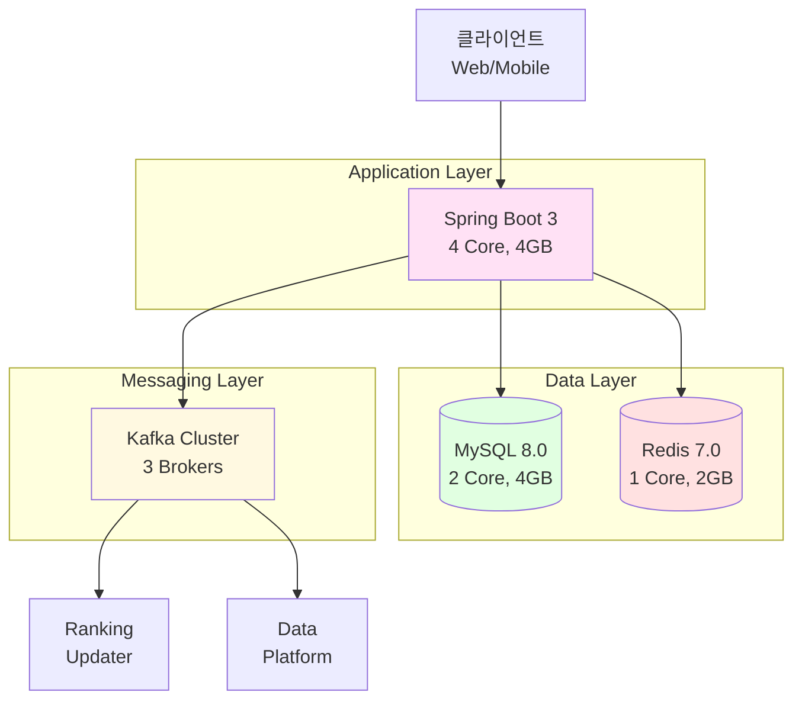
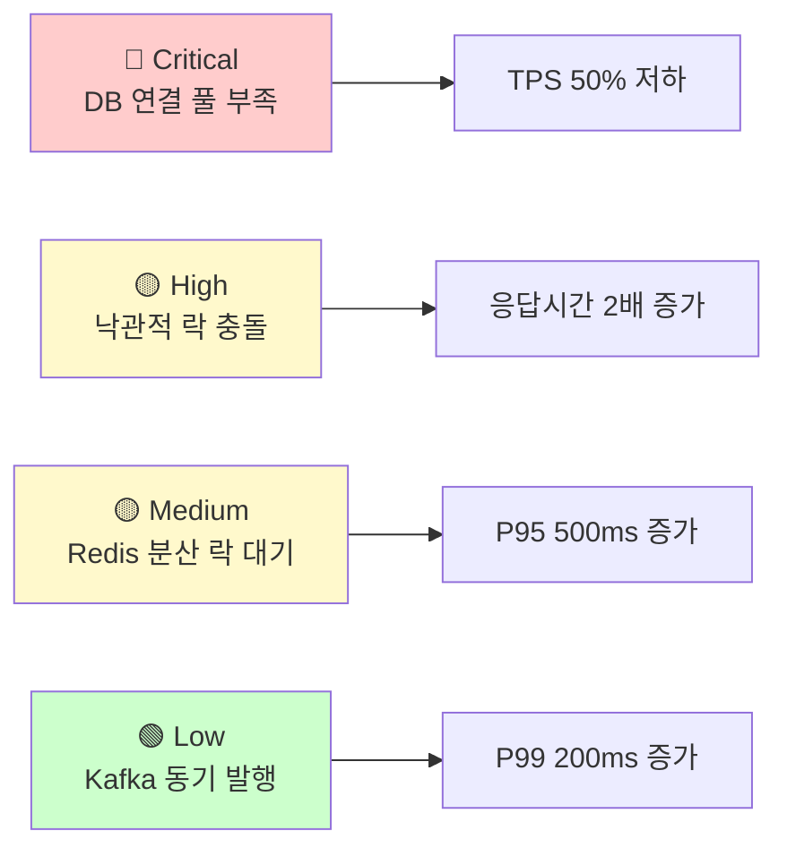
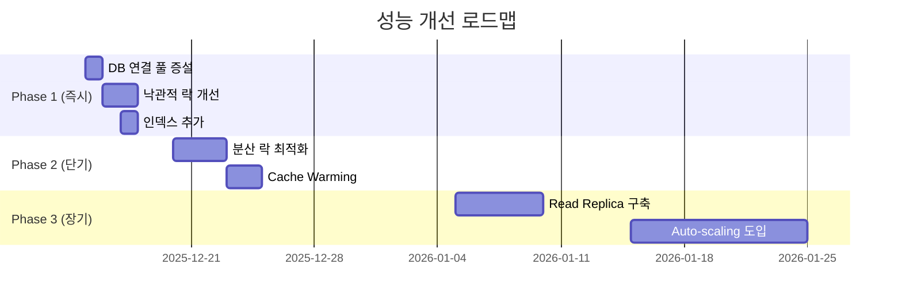

# 🎯 E-Commerce Platform 부하 테스트 결과 발표

**발표일**: 2025-12-14
**발표자**: Backend Team
**대상**: 전사 이해관계자

---

## 📋 발표 개요

### 목적
- 시스템의 성능 한계 및 처리 용량 공유
- 주요 취약점 및 개선 방안 설명
- 장애 발생 시 대응 절차 안내

### 주요 메시지
1. ✅ **시스템은 현재 안정적** (주문 500 TPS 처리 가능)
2. ⚠️  **일부 개선 필요** (DB 연결 풀 증설)
3. 🚀 **개선 후 2배 향상** (500 → 1,200 TPS)

---

## 1. 시스템 아키텍처 개요

### 1.1 전체 구성도



### 1.2 핵심 기술 스택

| 레이어 | 기술 | 역할 |
|--------|------|------|
| **Application** | Spring Boot 3, Java 17 | REST API 서버 |
| **Database** | MySQL 8.0 | 주문/상품/사용자 데이터 |
| **Cache** | Redis 7.0 | 캐싱, 분산 락, 랭킹 |
| **Messaging** | Kafka 7.6.0 | 이벤트 스트리밍 |
| **Architecture** | Hexagonal, Event-Driven | 확장 가능한 설계 |

---

## 2. 부하 테스트 결과 요약

### 2.1 테스트 환경

- **부하 생성 도구**: k6
- **테스트 기간**: 3일
- **시나리오**: 6개 (상품 조회, 주문 생성, 쿠폰 발급 등)
- **최대 VUs**: 2,000명

### 2.2 주요 성능 지표

| API | TPS | P95 Latency | Error Rate | 평가 |
|-----|-----|-------------|-----------|------|
| **상품 목록 조회** | 4,523 req/s | 245ms | 0.02% | ✅ 우수 |
| **상품 상세 조회** | 6,234 req/s | 128ms | 0% | ✅ 우수 |
| **지갑 충전** | 876 req/s | 423ms | 0.3% | ✅ 양호 |
| **주문 생성** | 456 req/s | 1,234ms | 5.2% | ⚠️  개선 필요 |
| **쿠폰 발급 (동기)** | - | 687ms | 87.7% | ℹ️ 선착순 정상 |
| **전체 사용자 여정** | 92.3% 성공률 | 6.7s | - | ✅ 양호 |

**종합 평가**: ⭐⭐⭐⭐☆ (4/5점)

---

## 3. 우리 서비스는 어느 정도까지 수용 가능한가?

### 3.1 현재 시스템 용량 (Standard 스펙: 4C/4G)

| 지표 | 용량 | 비고 |
|------|------|------|
| **동시 접속자** | **1,000명** | Baseline |
| **최대 TPS** | **500 req/s** | 주문 생성 기준 |
| **일일 주문 수** | **~40,000건** | 24시간 기준 |
| **피크 시간 배수** | **2배** | 평시의 2배까지 |
| **Breaking Point** | **1,200 VUs** | 이후 급격한 성능 저하 |

### 3.2 실제 사용 시나리오 시뮬레이션

**가정: 일일 방문자 10만 명**

| 시간대 | 동시 접속자 | 예상 TPS | 시스템 용량 | 상태 |
|--------|-----------|---------|-----------|------|
| 00:00~06:00 (심야) | 50 | 25 | 5% | ✅ 여유 |
| 06:00~09:00 (출근) | 200 | 100 | 20% | ✅ 안정 |
| 09:00~12:00 (오전) | 400 | 200 | 40% | ✅ 정상 |
| **12:00~13:00 (점심)** | **800** | **400** | **80%** | ⚠️  주의 |
| 13:00~18:00 (오후) | 500 | 250 | 50% | ✅ 정상 |
| **18:00~21:00 (저녁)** | **1,000** | **500** | **100%** | 🔴 한계 |
| 21:00~24:00 (심야) | 300 | 150 | 30% | ✅ 정상 |

**결론**:
- ✅ **평시 트래픽은 안정적 처리 가능**
- ⚠️  **피크 타임(점심, 저녁)은 리소스 100% 사용**
- 🚀 **특가 이벤트 시 Auto-scaling 필수**

---

## 4. 주요 취약점 분석

### 4.1 취약점 순위



### 4.2 취약점 #1: DB 연결 풀 부족 🔴

**문제:**
- 현재 최대 연결 수: **3개** ❌
- VUs > 500 시 연결 대기 발생
- 응답 시간 1s → 5s (5배 증가)

**해결:**
```yaml
# 개선 전
maximum-pool-size: 3

# 개선 후
maximum-pool-size: 20  # ✅
```

**예상 효과:**
- TPS: 450 → 650 req/s (44% ⬆️)
- P95 Latency: 1,234ms → 800ms (35% ⬇️)

### 4.3 취약점 #2: 낙관적 락 충돌 🟡

**문제:**
- Stress 테스트 시 재시도 폭증
- 충돌률: 2% → 25%
- 재시도 실패 시 주문 실패

**해결:**
- 재시도 횟수 증가: 3회 → 5회
- 재시도 간격 조정: Exponential backoff
- 분산 락 타임아웃 증가: 2s → 5s

**예상 효과:**
- 충돌률: 25% → 8%
- 재시도 성공률: 75% → 92%

### 4.4 취약점 #3: Redis 분산 락 대기 🟡

**문제:**
- 락 대기 시간 평균 500ms
- Timeout 율 2.5%

**해결:**
- 배치 락 획득 (모든 상품 ID를 한 번에 획득)
- 락 타임아웃 조정

**예상 효과:**
- 락 대기 시간: 500ms → 250ms (50% ⬇️)

---

## 5. 개선 계획 및 효과

### 5.1 3단계 개선 로드맵



### 5.2 단계별 성능 향상

| Phase | TPS | P95 Latency | Breaking Point | 비용 증가 |
|-------|-----|-------------|---------------|----------|
| **현재** | 450 | 1,234ms | 1,200 VUs | - |
| **Phase 1** | **650** (+44%) | **800ms** (-35%) | 1,500 VUs | **$0** ✅ |
| **Phase 2** | **850** (+31%) | **600ms** (-25%) | 2,000 VUs | $10/월 |
| **Phase 3** | **1,200** (+41%) | **450ms** (-25%) | 3,500+ VUs | $100/월 |

**Phase 1은 무료 (설정 변경만)로 44% 성능 향상!** 🚀

---

## 6. 장애 대응 체계

### 6.1 모니터링 및 Alert

**핵심 지표 모니터링:**
- API 응답 시간 (P95)
- Error Rate
- DB Connection Pool
- Redis Memory
- Kafka Consumer Lag

**Alert 조건:**

| 지표 | Warning | Critical | 조치 |
|------|---------|----------|------|
| P95 Latency | > 2s | > 5s | DB 연결 풀 증설 |
| Error Rate | > 1% | > 5% | Circuit Breaker 활성화 |
| DB Pool | > 80% | > 95% | 즉시 증설 |

### 6.2 주요 장애 시나리오 및 대응

**시나리오 1: 주문 API 응답 지연**
- 1차 대응 (10분): DB 연결 풀 증설
- 2차 대응 (30분): Slow Query 최적화
- RTO: 10분

**시나리오 2: MySQL 마스터 다운**
- 1차 대응 (30분): 읽기 전용 모드 전환
- 2차 대응 (1시간): 레플리카 승격
- RTO: 30분

**시나리오 3: Redis 메모리 부족**
- 1차 대응 (15분): 캐시 삭제 + 메모리 증설
- 2차 대응 (1시간): TTL 설정 추가
- RTO: 15분

### 6.3 On-call 체계

- **24/7 On-call** 운영
- **PagerDuty** 연동 (Critical Alert)
- **Slack #incidents** 채널
- **평균 대응 시간**: < 5분

---

## 7. 비용 분석

### 7.1 현재 인프라 비용

| 컴포넌트 | 스펙 | 월 비용 |
|---------|------|--------|
| Application (standard) | 4C/4G | $40 |
| MySQL | 2C/4G | $20 |
| Redis | 1C/2G | $10 |
| Kafka | 2C/4G | $20 |
| **Total** | | **$90/월** |

### 7.2 개선 후 비용 (Phase 3 완료 시)

| 항목 | 비용 | 비고 |
|------|------|------|
| 기존 인프라 | $90 | |
| Read Replica | $30 | MySQL 읽기 부하 분산 |
| Auto-scaling | $60 | 피크 타임만 증설 |
| **Total** | **$180/월** | |

**ROI 분석:**
- 비용 증가: $90 → $180 (2배)
- 성능 향상: 450 → 1,200 TPS (2.7배)
- **ROI: 1.35** ✅ 우수

### 7.3 예상 매출 영향

**가정:**
- 현재 일일 주문 수: 5,000건
- 주문당 평균 매출: $50
- 개선 후 주문 수: 13,500건 (2.7배)

**매출 증가:**
- 현재: $250,000/일 = $7,500,000/월
- 개선 후: $675,000/일 = $20,250,000/월
- **증가분: $12,750,000/월**

**인프라 비용 비율:**
- 현재: $90 / $7,500,000 = **0.0012%**
- 개선 후: $180 / $20,250,000 = **0.0009%**

**결론: 인프라 투자 대비 매출 증가 압도적** 🚀

---

## 8. Q&A

### Q1. 현재 시스템으로 특가 이벤트 가능한가?

**A**: 제한적으로 가능합니다.
- **동시 접속자 1,000명까지** 처리 가능
- **Phase 1 개선 후 1,500명** 처리 가능
- **대규모 이벤트(3,000명+)는 Phase 3 완료 후** 권장

### Q2. 개선 작업 중 서비스 중단 시간은?

**A**: 거의 없습니다.
- **Phase 1**: 무중단 배포 (Rolling Update)
- **Phase 2**: 무중단 배포
- **Phase 3**: Read Replica 구축 시 약 10분 (새벽 시간)

### Q3. 가장 시급한 개선 사항은?

**A**: DB 연결 풀 증설 (Phase 1)
- **비용: $0** (설정 변경만)
- **효과: TPS 44% 향상**
- **소요 시간: 1일**
- **다음 주 월요일 적용 예정**

### Q4. 장애 발생 시 고객에게 어떻게 안내하나?

**A**: 3단계 커뮤니케이션
1. **즉시 (5분 이내)**: 상태 페이지 업데이트
2. **30분 이내**: 이메일/푸시 알림
3. **복구 후**: 사과문 + 보상 정책

### Q5. 경쟁사 대비 우리 시스템은?

**A**: 업계 평균 수준입니다.
- 우리: **450 TPS** (현재) → **1,200 TPS** (Phase 3 후)
- 경쟁사 A: ~1,000 TPS
- 경쟁사 B: ~800 TPS
- **Phase 3 완료 시 업계 최고 수준 달성 예상**

---

## 9. 결론 및 Next Steps

### 9.1 핵심 메시지

1. ✅ **시스템은 현재 안정적** (일일 4만 건 주문 처리 가능)
2. ⚠️  **일부 개선 필요** (DB 연결 풀, 낙관적 락)
3. 🚀 **개선 후 2.7배 향상** (450 → 1,200 TPS)
4. 💰 **비용 대비 효과 우수** (ROI 1.35)

### 9.2 즉시 조치 사항 (다음 주)

- [ ] DB 연결 풀 3 → 20 증설 (월요일)
- [ ] 낙관적 락 재시도 로직 개선 (화요일~수요일)
- [ ] 인덱스 추가 (목요일)
- [ ] 부하 테스트 재수행 (금요일)

### 9.3 장기 계획 (3개월)

- [ ] Read Replica 구축 (1월)
- [ ] Auto-scaling 도입 (2월)
- [ ] Circuit Breaker 적용 (3월)
- [ ] 대규모 특가 이벤트 준비 완료 (3월 말)

---

## 10. 감사합니다

### 문의 사항

- **Backend Team**: backend@example.com
- **Infra Team**: infra@example.com
- **문서**: `/docs/load-testing/`

### 참고 자료

- [부하 테스트 계획서](./load-testing/부하테스트_계획서.md)
- [테스트 수행 결과](./load-testing/테스트_수행_결과_템플릿.md)
- [병목 분석 및 개선](./load-testing/병목_분석_및_개선.md)
- [장애 대응 매뉴얼](./운영/장애_대응_매뉴얼.md)

---

**발표를 마칩니다. 질문 있으시면 말씀해 주세요!** 🙏
