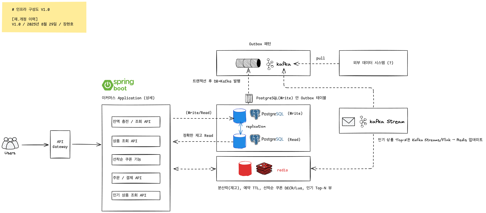

## 인프라 구성도 

### 📑 인프라 구성 요소 설명
#### 👥 Users
- 서비스 최종 사용자 (웹/모바일 클라이언트)
- API 호출을 통해 상품 조회, 쿠폰 발급, 주문/결제 기능 사용
#### 🔗 API Gateway
- 모든 외부 요청이 먼저 들어오는 진입점
- 내부 Spring Boot Application으로 트래픽을 라우팅
- LB 역할
#### 🌱 Spring Boot (이커머스 Application)
- 모놀리식 구조로 구성된 핵심 애플리케이션
- 주요 기능(API 모듈)
    - 잔액 충전/조회 API: 사용자 지갑 잔액 관리
    - 상품 조회 API: 정확한 재고 확인 및 상품 정보 제공
    - 선착순 쿠폰 기능: Redis 원자 연산으로 안전하게 발급
    - 주문/결제 API: 주문 생성, 결제, 지갑 차감, 재고 차감
    - 인기 상품 조회 API: Redis에서 실시간 Top-N 상품 조회
#### 🐘 PostgreSQL (Write / Read)
- Write DB (Primary)
    - 트랜잭션 기록(주문, 결제, 잔액, 쿠폰 등)
    - Outbox 테이블을 포함하여 이벤트 기록 보관
- Read DB (Replica)
    - 읽기 전용, 조회 API 트래픽 분산용
    - replication으로 Primary의 데이터 반영
#### 📦 Outbox 패턴
- DB 트랜잭션 커밋 시 Outbox 테이블에 이벤트 저장
- Outbox Worker가 해당 이벤트를 Kafka로 publish
- DB와 이벤트 발행 간 정합성을 보장하는 패턴
#### 📨 Kafka
- 이벤트 브로커 역할
- 주문/결제/쿠폰/지갑 이벤트를 Topic으로 발행
- 외부 데이터 플랫폼이나 Stream Processor가 구독 가능
#### 🔄 Kafka Streams / Flink
- Kafka 이벤트를 소비하여 실시간 집계 처리
- 최근 3일간 판매량 Top-N 상품을 계산
- 계산된 결과를 Redis에 push (Materialized View로 활용)
#### 🟥 Redis
- 초고속 In-Memory 데이터 저장소
- 주요 용도:
    - 분산락: 재고 동시성 제어
    - 예약 TTL: 주문 처리 중 임시 재고 예약
    - 쿠폰 발급 DECR/Lua: 선착순 쿠폰 원자적 발급
    - Top-N 뷰: Kafka Streams/Flink에서 갱신한 인기 상품 랭킹 저장
#### 📊 외부 데이터 시스템 (?)
- Kafka에 발행된 이벤트를 BI/Analytics/ML 플랫폼에서 활용
- 예: 실시간 매출 분석, 추천 시스템, 리포트 생성
